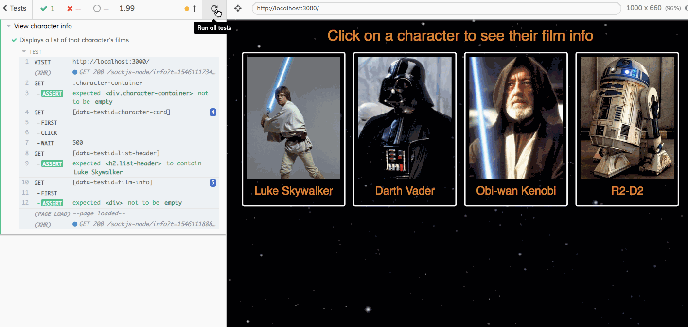

# Star Wars API Project
Allows users to click on a character to see a list of the films that character has appeared in.

## Technical notes
- Written in Javascript & React
- Tests use Jest & Enzyme
- Uses Star Wars API - https://swapi.co
- Styling uses a combination of Bootstrap and custom CSS

## Usage notes
- Download (or fork & clone) the repo
- `cd` into the project directory
- Run `npm install`
- Run `npm start`
- Go to the browser & click on a character!
- If necessary, run tests with `npm test`
- To run UI automation tests, run `npx cypress open`

## Link to deployed app
http://star-wars-api-challenge.com.s3-website-us-east-1.amazonaws.com

## Demo

## UI Automation test demo

